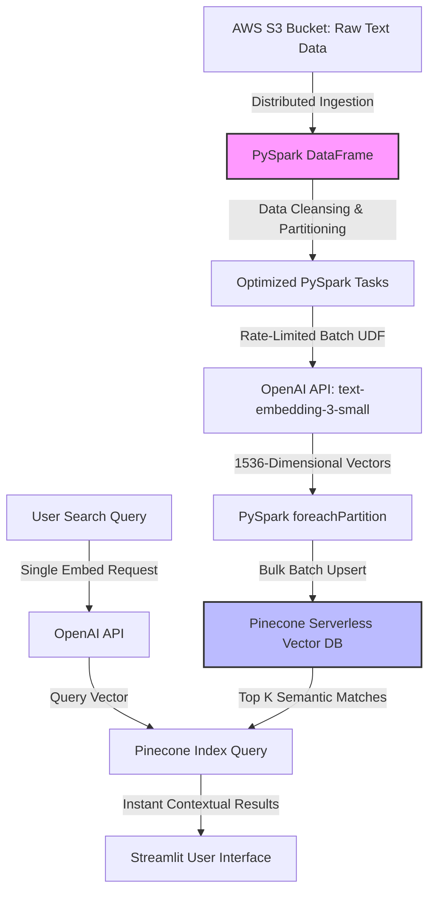

# Big-Data-Embedding-Semantic-Search-Pipeline

```mermaid
graph TD
    A[AWS S3 Bucket: Raw Text Data] -->|Distributed Ingestion| B[PySpark DataFrame]
    B -->|Data Cleansing & Partitioning| C[Optimized PySpark Tasks]
    C -->|Rate-Limited Batch UDF| D[OpenAI API: text-embedding-3-small]
    D -->|1536-Dimensional Vectors| E[PySpark foreachPartition]
    E -->|Bulk Batch Upsert| F[Pinecone Serverless Vector DB]
    
    G[User Search Query] -->|Single Embed Request| H[OpenAI API]
    H -->|Query Vector| I[Pinecone Index Query]
    F -->|Top K Semantic Matches| I
    I -->|Instant Contextual Results| J[Streamlit User Interface]
    
    style B fill:#f9f,stroke:#333,stroke-width:2px
    style F fill:#bbf,stroke:#333,stroke-width:2px
```
